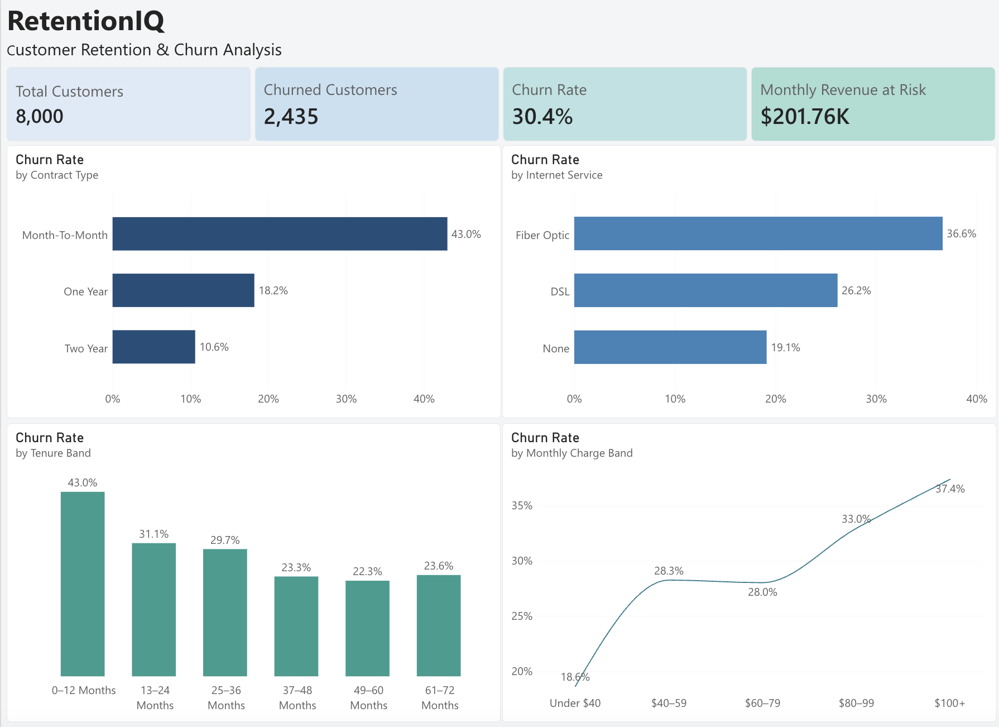
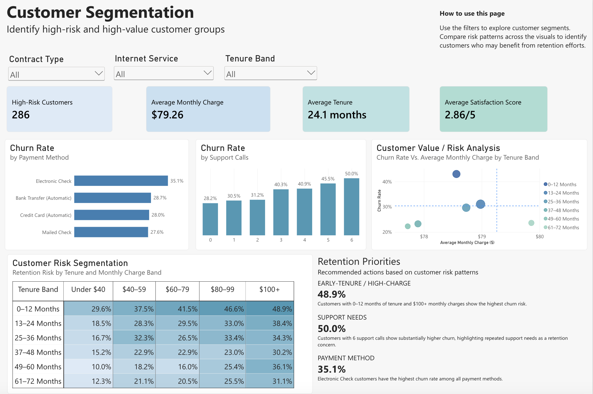

# RetentionIQ | Customer Retention & Churn Analysis

**Power BI | DAX | Power Query | Customer Analytics | Data Visualization**

RetentionIQ is a Power BI customer retention analysis designed to identify key churn drivers, high-risk customer segments, and actionable retention opportunities.

> **Data Note:** This project uses a synthetic dataset created specifically for portfolio analysis. No real customer information is included.

## Interactive Dashboard

**[View the Live Interactive Power BI Dashboard](https://app.fabric.microsoft.com/view?r=eyJrIjoiYmM2ODMxZTAtNzZmNi00MDhmLWE4YzItZDEzM2RhYTIyZWI5IiwidCI6IjA2NDA1NzU5LTQ4YmEtNGYyMi05OTNkLTc3NzY2NjAxMjU0OSJ9&pageName=1f38fcdbbcd09c46357a)**

Explore the dashboard interactively using slicers and cross-filtering to analyze customer churn patterns, high-risk segments, and retention opportunities.

---

## Dashboard

### Churn Overview

### Customer Segmentation

---

## Key Findings

- **Overall churn rate is 30.4%**, representing 2,435 churned customers out of 8,000 total customers.
- **Monthly revenue associated with churned customers is approximately $201.76K**, highlighting the financial impact of customer attrition.
- **Month-to-month customers have a 43.0% churn rate**, substantially higher than customers on longer-term contracts.
- Customers with **0–12 months of tenure have a 43.0% churn rate**, indicating that the earliest stage of the customer relationship is particularly important for retention.
- Customers paying **$100+ per month have a 37.4% churn rate**, suggesting higher monthly charges are associated with increased churn risk.
- **Electronic Check customers have the highest churn rate by payment method at 35.1%.**
- Churn increases alongside repeated support interactions, reaching **50.0% among customers with 6 support calls**.
- The highest-risk tenure and charge combination is **0–12 months of tenure with $100+ monthly charges**, with a churn rate of **48.9%**.

---

## Business Recommendations

1. **Prioritize early-tenure retention efforts.**  
   Customers within their first 12 months show significantly elevated churn, particularly those with high monthly charges.

2. **Target high-risk month-to-month customers.**  
   Encourage longer-term contracts through targeted incentives, loyalty benefits, or personalized retention offers.

3. **Use repeated support activity as an early warning signal.**  
   Customers requiring frequent support show higher churn rates and may benefit from proactive service outreach.

4. **Review the experience of high-charge customers.**  
   Higher monthly charges are associated with increased churn, suggesting an opportunity to evaluate pricing, perceived value, and service bundles.

5. **Investigate payment-method friction.**  
   Electronic Check customers experience the highest churn rate among payment methods and may be a useful segment for targeted retention analysis.

---

## Business Problem

A telecommunications company is experiencing customer churn and wants to understand:

- Which customers are leaving?
- What factors are associated with churn?
- Which customer segments demonstrate the greatest retention risk?
- Where should retention efforts be prioritized?

The goal of this project is to transform customer-level data into an interactive Power BI dashboard that helps decision-makers identify churn patterns and prioritize retention opportunities.

---

## Dataset

The dataset contains **8,000 fictional telecommunications customers** and 23 fields covering:

- Customer demographics
- Tenure
- Contract type
- Internet and phone services
- Monthly and total charges
- Payment method
- Support activity
- Satisfaction
- Customer churn

Each row represents one customer.

The raw dataset is available in the [`data`](data/) folder.

---

## Data Preparation

Data preparation was completed in **Power Query** before analysis.

Key cleaning steps included:

- Standardized inconsistent Contract Type values.
- Removed leading and trailing spaces from Payment Method.
- Identified and handled missing Total Charges values.
- Applied appropriate numeric and text data types.
- Verified Customer IDs for duplicates.
- Validated the dataset before building the analytical model.

Missing Total Charges values were estimated using Monthly Charges and customer tenure where appropriate.

---

## DAX & Data Modeling

DAX measures and calculated columns were created to support churn analysis and customer segmentation.

Core measures include:

- Total Customers
- Churned Customers
- Churn Rate
- Monthly Revenue at Risk
- High-Risk Customers
- Average Monthly Charge
- Average Tenure
- Average Satisfaction Score

Calculated columns were also created for:

- Tenure Band
- Tenure Band Sort
- Monthly Charge Band
- Monthly Charge Band Sort

The complete DAX documentation is available in [`dax/measures.md`](dax/measures.md).

---

## High-Risk Customer Segmentation

A rule-based high-risk customer segment was created to identify active customers who demonstrate multiple characteristics associated with churn.

High-risk customers are defined as:

- Currently active customers
- Month-to-month contract
- Satisfaction score of 3 or lower
- AND either:
  - 2 or more support calls in the last 12 months, or
  - 12 months or less of tenure

This identified **286 active high-risk customers** for potential retention efforts.

This segmentation is descriptive and rule-based rather than a predictive machine-learning model.

---

## Dashboard Features

### Churn Overview

The executive overview provides:

- Total Customers
- Churned Customers
- Churn Rate
- Monthly Revenue at Risk
- Churn by Contract Type
- Churn by Internet Service
- Churn by Tenure
- Churn by Monthly Charge

### Customer Segmentation

The segmentation page provides:

- Contract Type, Internet Service, and Tenure Band slicers
- High-risk customer KPIs
- Churn by Payment Method
- Churn by Support Calls
- Customer Value / Risk Analysis
- Customer Risk Segmentation heatmap
- Retention priorities based on observed churn patterns

---

## Tools & Skills Demonstrated

- **Power BI** — dashboard development and interactive reporting
- **Power Query** — data cleaning and transformation
- **DAX** — measures, calculated columns, and customer segmentation
- **Data Visualization** — KPI cards, bar charts, line charts, scatter plots, and matrix heatmaps
- **Customer Analytics** — churn analysis and retention segmentation
- **Business Analysis** — translating analytical findings into actionable recommendations
- **Data Storytelling** — presenting technical analysis in an executive-friendly format

---

## Next Steps

Potential future enhancements include:

- Adding additional customer behavior and engagement variables.
- Comparing churn patterns across more detailed service combinations.
- Developing additional retention segments based on customer value.
- Evaluating retention campaign performance if campaign-response data becomes available.
- Extending the analysis into predictive churn modeling as a separate future project.
